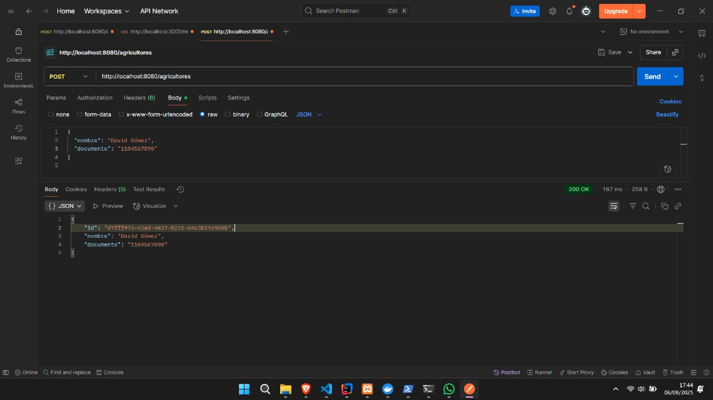
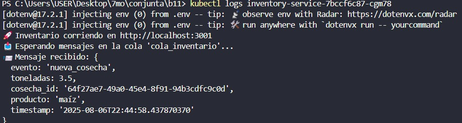
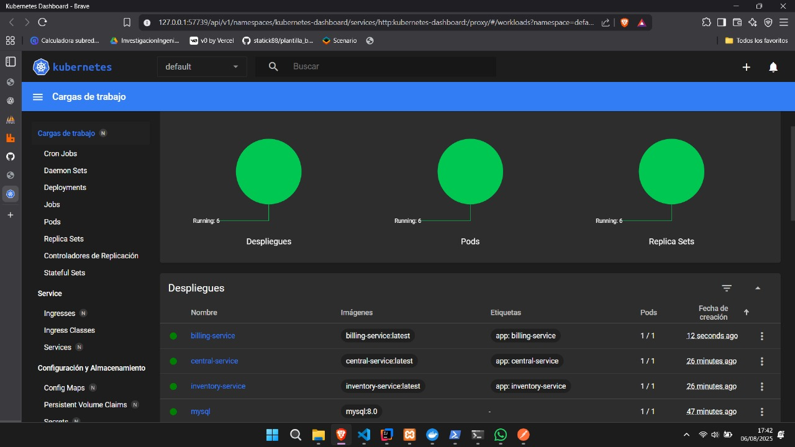

# Conjunta_agruciltores

Este proyecto contiene tres microservicios: Central-Service, Inventory-Service y Billing-Service. A continuación, se detallan las instrucciones para descargar el repositorio, las tecnologías utilizadas y los comandos para desplegar los servicios en Kubernetes usando Minikube.

## Descargar el Repositorio

Para clonar el repositorio, ejecuta el siguiente comando en tu terminal:

```bash
git clone https://github.com/31MartinS/Conjunta_agruciltores.git
```

Luego, navega al directorio del proyecto:

```bash
cd Conjunta_agruciltores
```

## Tecnologías

El proyecto utiliza las siguientes tecnologías para cada microservicio:

- **Central-Service**: Spring Boot, PostgreSQL
- **Inventory-Service**: Node.js, MySQL
- **Billing-Service**: Flask, MySQL, RabbitMQ

## Despliegue en Kubernetes

Sigue estos pasos para desplegar los microservicios en Kubernetes usando Minikube.

### Prerrequisitos

- Instala [Minikube](https://minikube.sigs.k8s.io/docs/start/)
- Instala [Docker](https://docs.docker.com/get-docker/)
- Instala [kubectl](https://kubernetes.io/docs/tasks/tools/)

### Pasos

1. **Iniciar Minikube**

   Inicia Minikube con el controlador de Docker:

   ```bash
   minikube start --driver=docker
   ```

2. **Habilitar Ingress**

   Activa el complemento Ingress para Minikube:

   ```bash
   minikube addons enable ingress
   ```

3. **Configurar el Entorno de Docker**

   Configura la terminal para usar el daemon de Docker de Minikube:

   ```bash
   eval $(minikube docker-env)
   ```

4. **Construir Imágenes Docker**

   Construye las imágenes Docker para cada microservicio:

   ```bash
   docker build -t central-service .
   docker build -t inventory-service .
   docker build -t billing-service .
   ```

5. **Aplicar Configuraciones de Base de Datos**

   Despliega las configuraciones de las bases de datos en Kubernetes:

   ```bash
   kubectl apply -f k8s/
   ```

6. **Aplicar Configuraciones de Servicios**

   Despliega las configuraciones de los servicios en Kubernetes:

   ```bash
   kubectl apply -f b11/
   ```

7. **Verificar Pods**

   Verifica el estado de los pods para asegurarte de que estén en ejecución:

   ```bash
   kubectl get pods
   ```

8. **Reenvío de Puertos**

   Reenvía los puertos para acceder a los servicios localmente:

   ```bash
   kubectl port-forward svc/central-service 8080:8080
   kubectl port-forward svc/inventory-service 3000:3000
   kubectl port-forward svc/billing-service 5000:5000
   ```

   - Central-Service estará disponible en `http://localhost:8080`
   - Inventory-Service estará disponible en `http://localhost:3000`
   - Billing-Service estará disponible en `http://localhost:5000`


## Capturas de Pantalla de la Ejecución

A continuación, se muestran capturas de pantalla que ilustran el funcionamiento del proyecto:

- **Prueba de API con Postman**  
    
  Esta imagen muestra una solicitud POST exitosa a la API de agricultures.

- **Logs del Servicio de Inventario**  
    
  Esta imagen muestra los logs del servicio de inventario ejecutándose localmente.

- **Panel de Kubernetes**  
    
  Esta imagen muestra el estado de los despliegues en el dashboard de Kubernetes.

## Notas

- Asegúrate de que todos los prerrequisitos estén instalados y configurados correctamente antes de iniciar el despliegue.
- Los directorios `k8s/` y `b11/` deben contener los manifiestos de Kubernetes necesarios para las bases de datos y los servicios, respectivamente.
- Si encuentras problemas, verifica los logs de los pods usando `kubectl logs <nombre-del-pod>` para solucionar errores.
